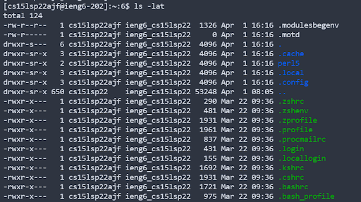

# Lab Reports

## [Report 1](https://asandoval2313.github.io/cse15l-lab-reports/lab-report-1-week-2.html)

## [Report 2](https://asandoval2313.github.io/cse15l-lab-reports/lab-report-2-week-4.html)

## [Report 3](https://asandoval2313.github.io/cse15l-lab-reports/lab-report-3-week-6.html)

*Hello* **my** 
# is
> Adrian
[How are you](https://www.google.com/)

* today
* is
* friday

1. tomorrow 
2. is 
3. saturday

`weekend :)`

## Testing github pages :O

[Lab Report 1](lab-report-1-week-2.md)

[Another Link to Report 1](https://<your-username>.github.io/<your-lab-reports-repo>/lab-report-1-week-2.html)

