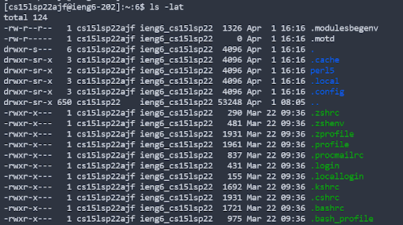

# Week 1-2 Lab Report

1. The first step is to download a code editor on your personal computer. We used VS code. I already had it installed but one thing I did install was the Java collection in the extensions section of Vs code. 

2. The second step is to remotely connect using SSH. Type `ssh (username).ieng6.ucsd.edu` in the terminal, and then enter your password. 

3. Now that you're connected you can mess around with a few commands. One of the commands I experimented with was ls -lat, which is a combination of running ls -l, ls -a, and ls, -t. Basically it gives you a list of all files (even hidden) in order by most recent, with extra information for each file. 

4. If you want to move files to and from the server, you can use SCP. Type `scp (name of the file you want to move) (directory you want to move it to)`. It will prompt you for your password and you should see it get transferred over. 

5. If you don't want to have to keep entering your password in all the time, you can set up a SSH key. In your terminal run `ssh-keygen`, then set the directory where you want to save your keygen. You can pretty much press enter for most of the steps to chose the default option. Once the SHA-256 key is generated, copy the public key using scp over to the remote directory. Now you can log in without having to enter your password. 

6. If you want to make your command running more effective, there are certain things you can do. I put all of the commands into one line, and used semi-colons to run commands after the other. This made my runtime about 5-10 seconds faster. 

