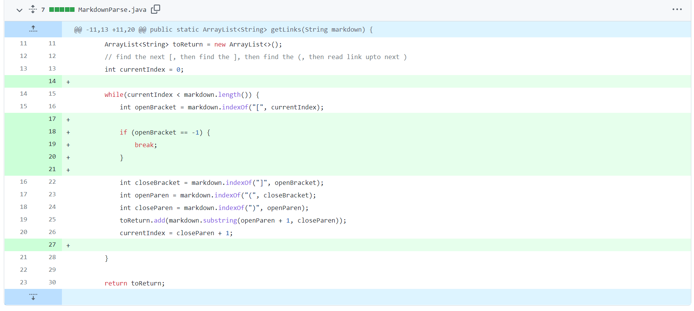
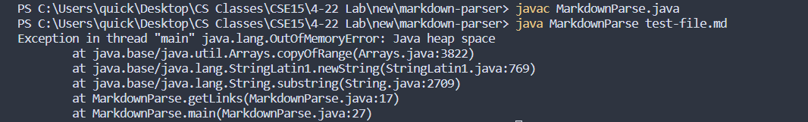
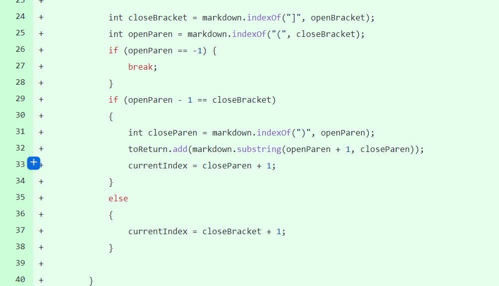
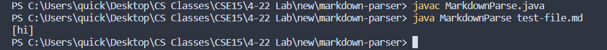
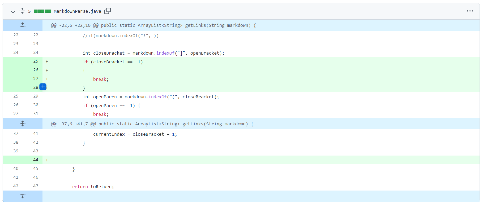
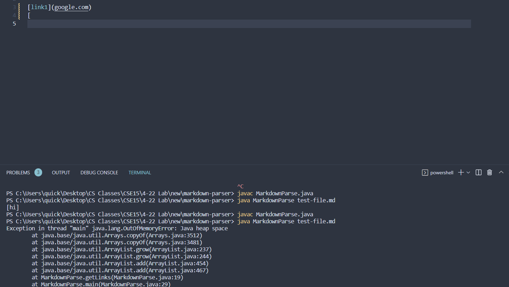

# Week 3-4 Lab Report

### If you'd like to read my first lab report, please head [here](https://asandoval2313.github.io/cse15l-lab-reports/lab-report-1-week-2.html)

# Code Change #1

## Commit Message

[Test File that Prompted Fix](https://github.com/leahkuruvila/markdown-parser/blob/6938e7d578994dbde1da1c611c9ee5034838fcc9/test-file.md)

## Symptom/Error

### Symptom
Infinite loop (heap error)
### Bug
Flaw in logic
### Explanation
Whenever an open bracket was not found, the indexOf method would return -1. At the end of the while +1 would be added to this current index, which would reset it back to 0, so it would just infinitely keep searching for a character that wasn't there. We had to add a conditional where if `openBracket == -1` we would `break` out of the loop.

# Code Change #2

## Commit Message

[Test File that Prompted Fix](https://github.com/asandoval2313/markdown-parser/blob/main/test1.md)

## Symptom/Error

### Symptom
Wrong output
### Bug
Flaw in logic
### Explanation
Since our code assumed that the parenthesis would be right next to the brackets, it would give the wrong output when this wasn't the case. To fix this, we added a check to make sure the index of the opening parenthesis was directly next to the index of the closing parenthesis. 

# Code Change #3

## Commit Message

[Test File that Prompted Fix](https://github.com/asandoval2313/markdown-parser/blob/main/test2.md)

## Symptom/Error

### Symptom
Infinite loop (heap error)
### Bug
Flaw in logic
### Explanation
Anytime there was a lone open bracket or parenthesis at the end of the code, it would continue to search for the closing pair infinitely. To fix this we did something very similar to what we did in the first bug, what was to just add a conditional to each index variable to ensure we were never searching for something that didn't exist. 
