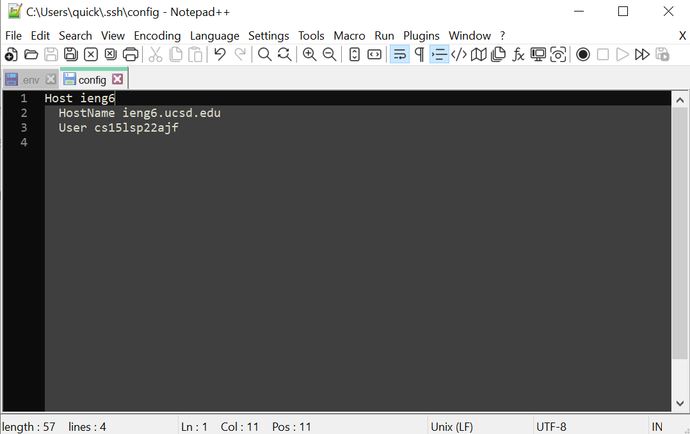
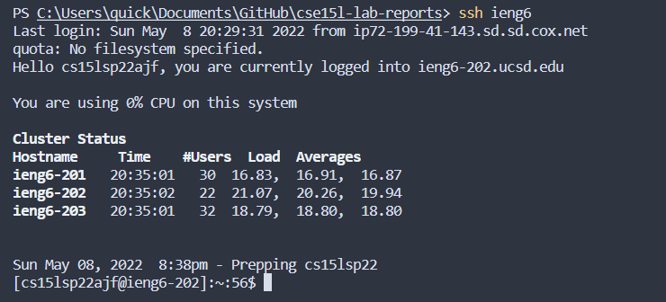
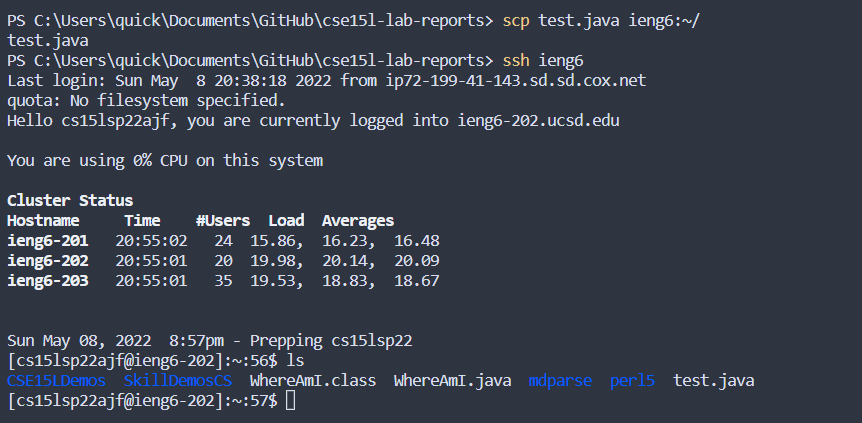
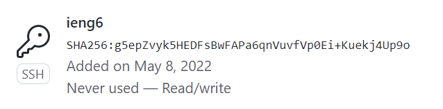
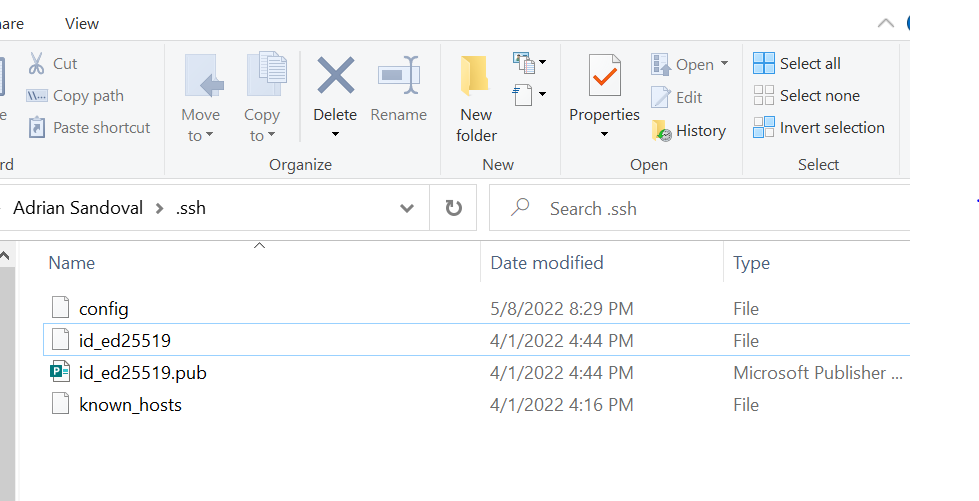
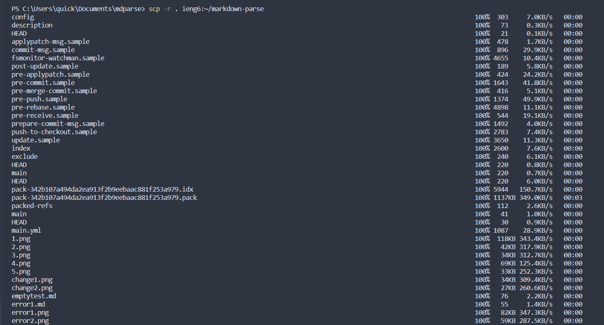
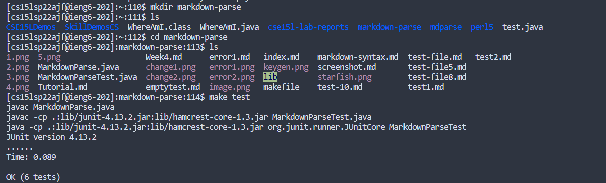
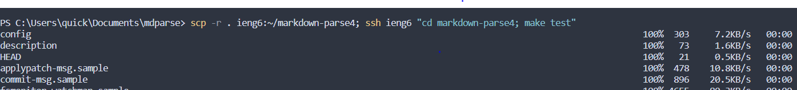

## [Index](https://asandoval2313.github.io/cse15l-lab-reports/index.html)

# Streamling SSH Configuration

First I edited my SSH config file to include the ieng6 host, and gave it the hostname and my username. 

Here's me loggin in to my ieng6 account using just the host alias. It reduces the time by a lot, especially when used in combination with SSH keys.

Once I've set up the alias I can SCP using it. Here I SCP a test file over my SSH account using the alias, which removes a few keystrokes. 

# Setting up Github Access from Ieng6

The top image shows where I have my public key stored on github, and the bottom image shows where I have my private/public keys stored on my user account. 

# SCPing Entire Directories

Here I transfer an entire directory recursively using `-r` and by copying the file with a period. 

Once I've transferred it over I can run the tests on my remote account!

Here I run all of the commands on one line using strategies I learned from lab 1.