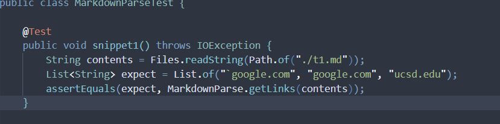
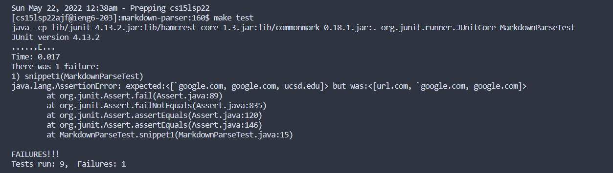
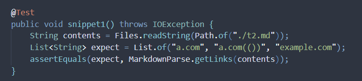
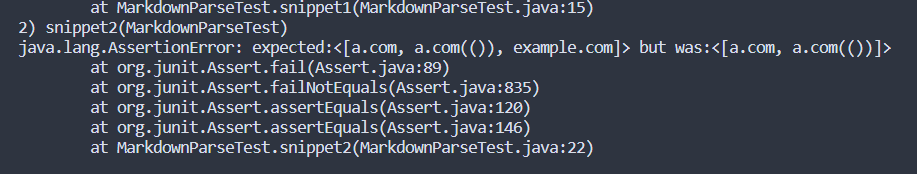
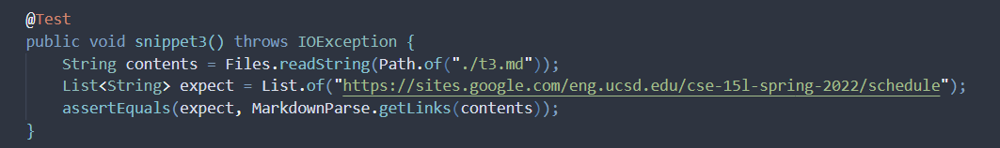
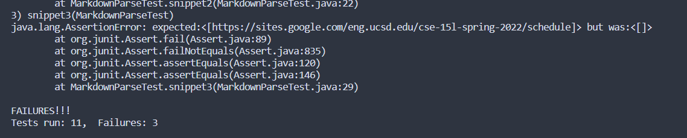

## [Index](https://asandoval2313.github.io/cse15l-lab-reports/index.html)

### My Implementation 
[Link to Repo](https://github.com/asandoval2313/markdown-parser)

### Implementation I reviewed
[Link to Repo](https://github.com/leahkuruvila/markdown-parser)

## Snippet 1:

### Expected Output
[\`google.com, google.com, ucsd.edu]

### <u>Junit Test</u>

### <u>Results</u>

Both my implementation and the implementation I reviewed failed test 1. 

## Snippet 2:

### Expected Output
[a.com, a.com(()), example.com]

### <u>Junit Test</u>

### <u>Results</u>

Both implementations failed the second snippet test

## Snippet 3:

### Expected Output
[(https://sites.google.com/eng.ucsd.edu/cse-15l-spring-2022/schedule)]

### <u>Junit Test</u>

### <u>Results</u>

For this snippet my implementation failed but the implementation I reviewed passed. 

## Follow up Questions

1. 
