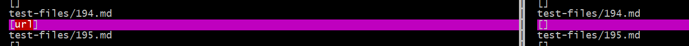
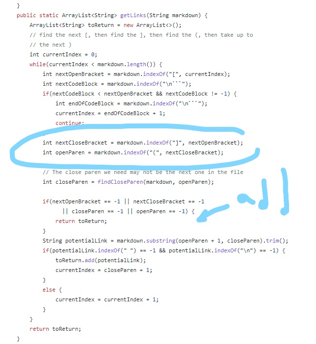
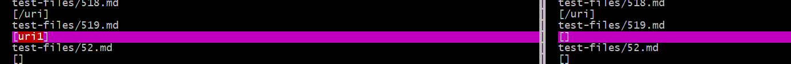
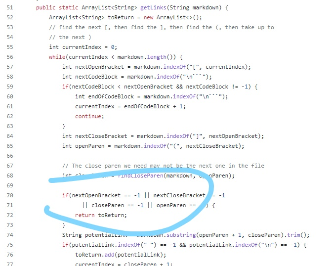

## [Index](https://asandoval2313.github.io/cse15l-lab-reports/index.html)

### How I found the Tests
* I found the tests by running the script.sh file and saving the results to a file called resulsts. Then I compared the two results files using Vimdiff. 

## [Test File 1](https://github.com/nidhidhamnani/markdown-parser/edit/main/test-files/194.md)
1. Neither implementation gave the correct output for the first test file. 
2.  
The left result is the implementation provided by CSE15L, and the right result is my own implementation.
3. The expected result is `[my_url]`. 
4. To be honest I'm not 100% sure why this test file even has a valid link. I'm assuming it has something to do with the colon, which registers the things after it as a reference for the stuff before it? This would be something pretty complicated to fix, but it might require checking for a colon after the closing bracket parsing the stuff after it that's inside of parenthesis. Or maybe implement some method to skip/escape the parenthesis when it's found. 

We could add a variable to look for a special character where the circle is and then add an if statement to skip or parse the things behind it. 

## [Test File 2](https://github.com/nidhidhamnani/markdown-parser/edit/main/test-files/519.md)
1. My implementation gave the correct output for this file while the implementation provided by CSE15L did not.
2. 
The left result is the implementation provided by CSE15L, and the right result is my own implementation.
3. The expected result is `[]`.
4. The bug that's causing the wrong output is that the code doesn't realize that the link is being sandwiched between an image. In order to fix this we'd have to change the part of the code that checks the indices of the adjacent brackets/parenthesis, and ensure that there is at least a space between the exclamation mark and the open bracket. 

In order to fix this bug we should add more if statements under the one that checks for nextOpenBracket/nextClockBracket == -1, so check for the position of the exclamation mark and adjacent brackets. 